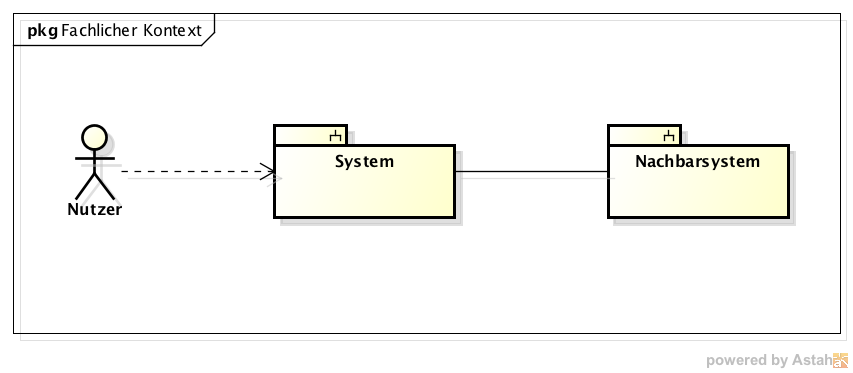
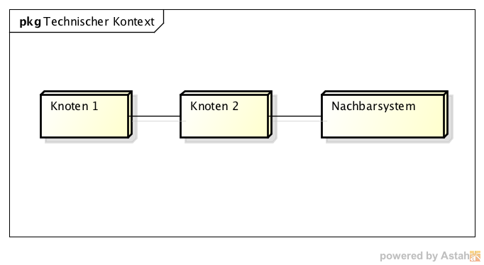

Kontextabgrenzung
=================

Fachlicher Kontext
------------------

Technischer- oder Verteilungskontext
------------------------------------

Externe Schnittstellen
----------------------

| Name der Schnittstelle | Beschreibung |
| ---------------------- | ------------ |
|                        |              |
