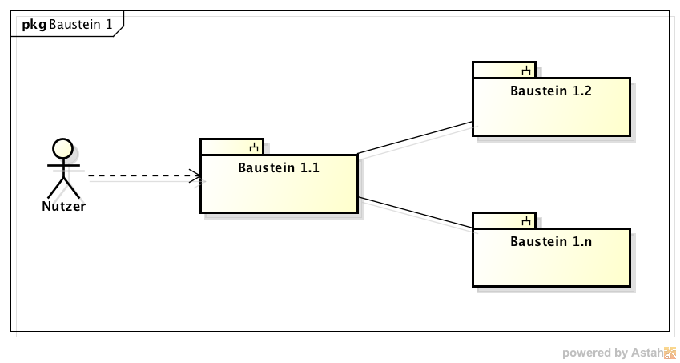

### Name (Whitebox)

**Überblick:**

**Begründung:**

**Enthaltene Bausteine:**

**Interne Schnittstellen:**

| Name der Schnittstelle | Beschreibung |
| ---------------------- | ------------ |
|                        |              |

**Offene Punkte:**
